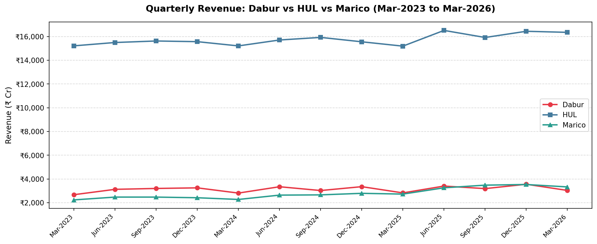
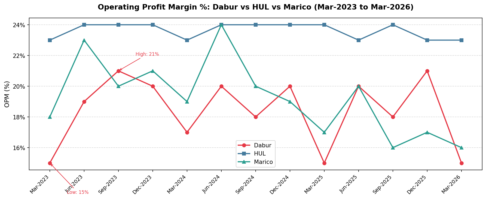
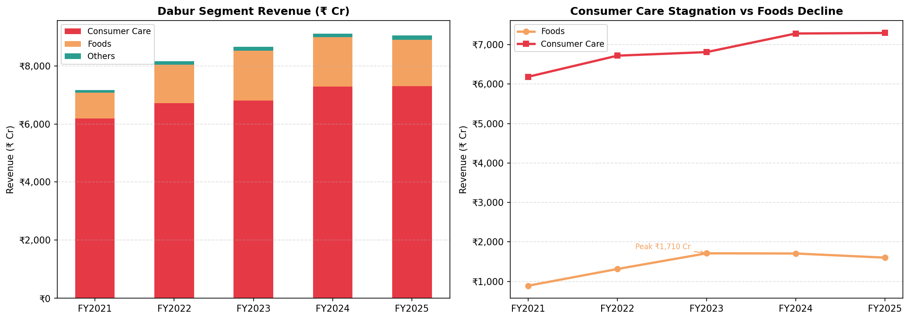
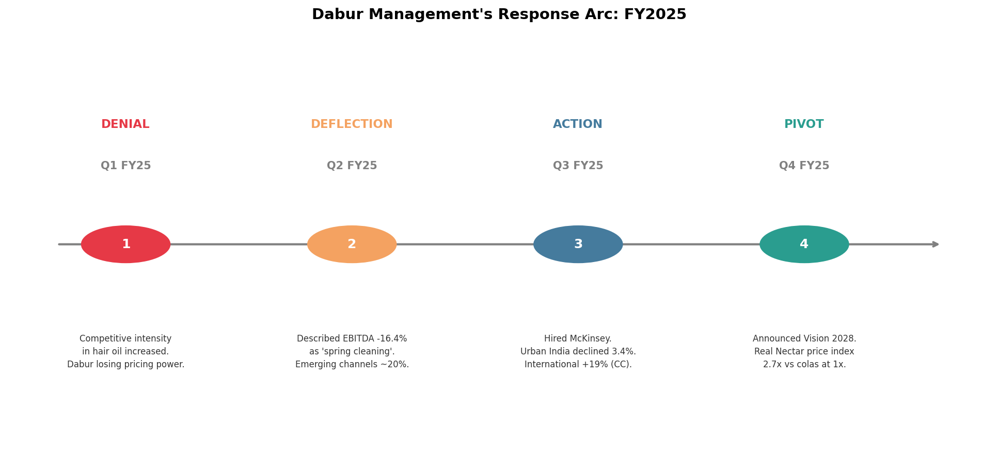
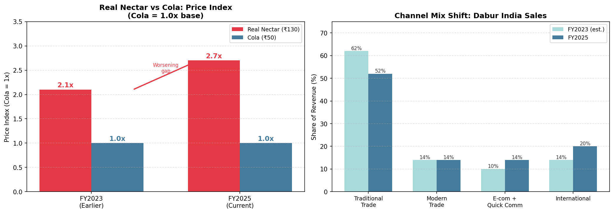

# Dabur's Urban Slowdown — Why India's Ayurvedic Giant is Losing Ground and What to Do About It

   

A consulting-style independent case study analysing Dabur India's financial performance, urban slowdown, and strategic positioning against FMCG peers (HUL and Marico) — using Python-based data analysis across 13 quarters of public financial data.

---

## Table of Contents
- [Project Overview](#project-overview)
- [Key Findings](#key-findings)
- [Visualisations](#visualisations)
- [Recommendations](#recommendations)
- [Data Sources](#data-sources)
- [Tools & Methodology](#tools--methodology)
- [Repository Structure](#repository-structure)
- [About](#about)

---

## Project Overview

Dabur India's India business declined 3.4% YoY in Q4 FY25, even as the broader FMCG sector recovered. This case study investigates the structural causes of that underperformance through quantitative benchmarking against HUL and Marico, segment-level revenue analysis, and qualitative analysis of investor concall transcripts across FY2025.

**Business Question:** What is driving Dabur's urban slowdown, and what strategic actions should management prioritise?

**Framework used:** Situation → Problem Diagnosis → Root Cause Analysis → Recommendations

---

## Key Findings

| # | Finding | Data Point |
|---|---------|-----------|
| 1 | Dabur's revenue growth significantly lags peers | +13.4% over 3 years vs Marico's +48.8% |
| 2 | Structural margin gap vs HUL | Dabur avg OPM 18.4% vs HUL 23.6% — 5pt gap |
| 3 | Dabur margins are highly volatile | OPM range of 6% vs HUL's 1% — weak pricing power |
| 4 | Foods segment growth has reversed | Peaked at ₹1,710 Cr (FY23), declined to ₹1,600 Cr (FY25) |
| 5 | Consumer Care is stagnant | +18% cumulative over 5 years — near-zero real growth |
| 6 | Urban FMCG collapsed | Growth fell from 11% (Q1 FY24) to 2.8% (Q2 FY25) |
| 7 | Beverages pricing crisis | Real Nectar price index vs cola worsened: 2.1x → 2.7x |
| 8 | Management response was delayed | Denial (Q1) → Deflection (Q2) → McKinsey (Q3) → Vision 2028 (Q4) |
| 9 | Channel transition lagging | Traditional trade still 52% of India revenue in FY2025 |
| 10 | Recovery is fragile | YoY revenue +7.3% (Mar-26) but OPM back to 15% low |

---

## Visualisations

### 1. Revenue Growth: Dabur vs HUL vs Marico (Mar-2023 to Mar-2026)


### 2. Operating Profit Margin Comparison


### 3. Segment Revenue: Consumer Care vs Foods (FY2021–FY2025)


### 4. Management Response Arc — FY2025 Concall Analysis


### 5. Beverages Pricing Crisis & Channel Mix Shift


---

## Recommendations

**1. Reprice the Beverages Portfolio**
Launch a "Real Active" sub-brand at ₹75/litre — fortified, lower-sugar, targeting urban health-conscious consumers aged 25–40. Bring price index vs cola down from 2.7x to ~1.5x without cannibalising core Real Nectar.

**2. Accelerate Emerging Channel Penetration**
Create a dedicated digital-first P&L with its own team and budget. Partner with Blinkit and Zepto for exclusive SKU launches. Target: emerging channel share from 14% → 22% of India sales by FY2027.

**3. Premiumise Consumer Care via Clinically-Backed Claims**
Launch a "Dabur Clinica" sub-brand with AYUSH-validated claims across hair growth, toothpaste, and immunity. Price at 30–40% premium to existing SKUs to lift Consumer Care OPM toward 22%+.

---

## Data Sources

| Dataset | Source | Period |
|---------|--------|--------|
| Dabur India quarterly results | BSE/NSE public filings | Q1 FY23 – Q4 FY26 (13 quarters) |
| HUL quarterly results | BSE/NSE public filings | Q1 FY23 – Q4 FY26 (13 quarters) |
| Marico quarterly results | BSE/NSE public filings | Q1 FY23 – Q4 FY26 (13 quarters) |
| Dabur segment revenue | Dabur Annual Reports | FY2021 – FY2025 |
| Investor concall transcripts | Dabur IR website | Q1 – Q4 FY25 |

> **Note:** HUL's Dec-2025 net profit (₹6,603 Cr) reflects a one-time exceptional item — retained in dataset but excluded from margin trend analysis. Dabur FY2025 total segment revenue treated as ₹9,070.71 Cr (floating-point artefact in source data).

---

## Tools & Methodology

- **Microsoft Excel** — Data collection and structuring (`Quarterly_results.xlsx`, 5 sheets)
- **Python (Pandas, Matplotlib)** — Quantitative analysis and visualisation in Google Colab
- **Notebook:** `Dabur_Analysis_Phase3.ipynb` (included in this repo)

**Analytical approach:**
- 3-year revenue growth benchmarking vs peers
- Operating margin analysis across 13 quarters (average, range, volatility)
- Segment revenue decomposition (FY2021–FY2025)
- Qualitative concall transcript analysis mapped to strategic response arc

---

## Repository Structure

```
dabur-urban-slowdown-case-study/
│
├── Dabur_Analysis_Phase3.ipynb   # Google Colab notebook with full Python analysis
├── revenue_trend.png              # Chart 1: Revenue comparison
├── opm_trend.png                  # Chart 2: Operating margin comparison
├── segment_trend.png              # Chart 3: Segment revenue breakdown
├── management_narrative.png       # Chart 4: Concall response arc
├── pricing_channels.png           # Chart 5: Pricing crisis & channel mix
└── README.md                      # This file
```

---

## About

**Sweta Sahani R**
BBA (Hons.), VIT Business School Chennai | Merit Scholar |
Google Certified Data Analyst | Consulting & Strategy

This is an independent academic project completed as part of my consulting and strategy portfolio. All data is sourced from public filings. This is not investment advice.

[](https://www.linkedin.com/in/sweta-sahani-686251409/?lipi=urn%3Ali%3Apage%3Ad_flagship3_profile_view_base_contact_details%3BDqvS3GQjRM672SntwIR%2Byw%3D%3D)
[](https://github.com/Sweta-Sahani)

